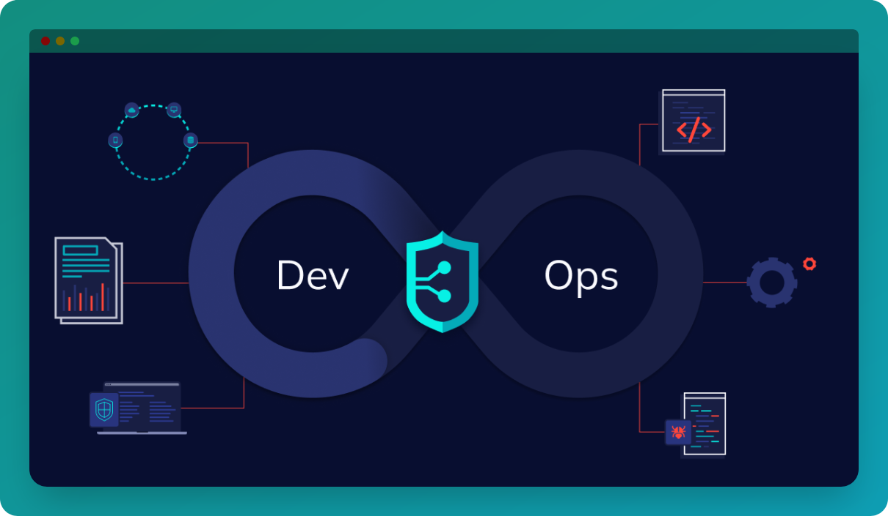

# Dev-Sec-Ops

Dev-Sec-Ops, which is an amalgamation of Development, Security, and Operations, underscores the integration of security throughout the software development lifecycle. This project serves as a experimental demonstration of how to embed security measures into the development pipeline for Android applications built with Flutter.

## Getting Started

For help getting started with Flutter development, view the
[online documentation](https://docs.flutter.dev/), which offers tutorials,
samples, guidance on mobile development, and a full API reference.

## Features:

- Integration of security tools and practices into the development workflow.
- Automated vulnerability scanning.
- Continuous monitoring for security vulnerabilities.
- Secure coding practices

## Contributing

Contributions are welcome! If you find any issues or have suggestions for improvements, please open an issue or create a pull request following the contribution guidelines.
